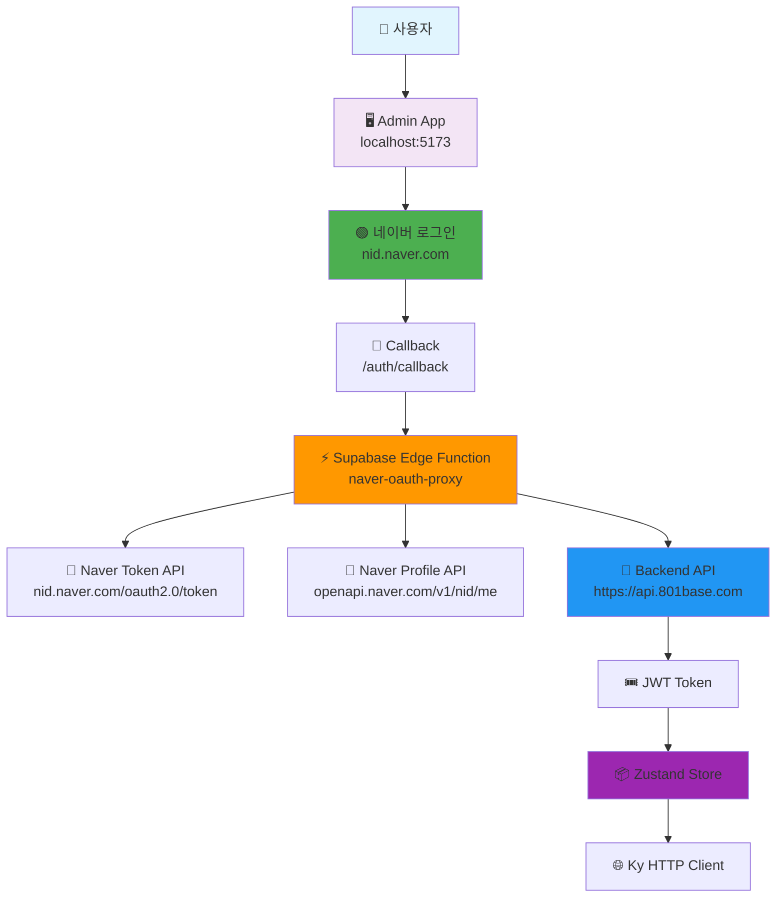
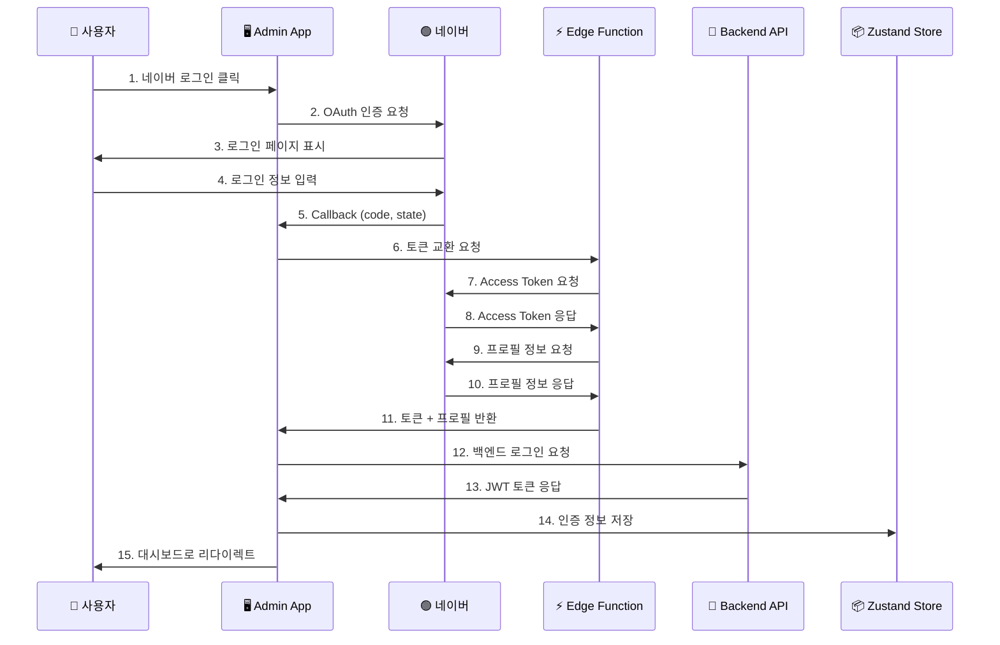
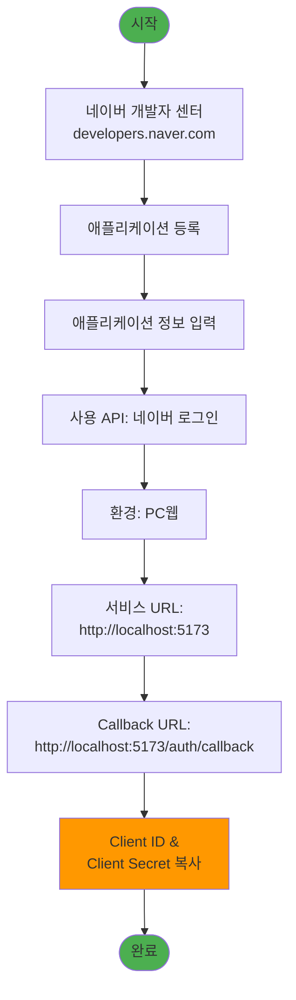
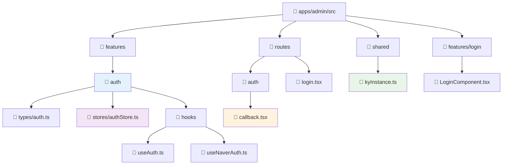
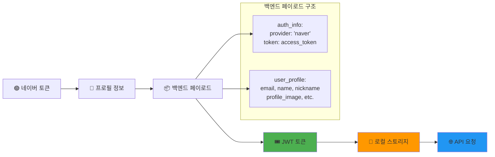
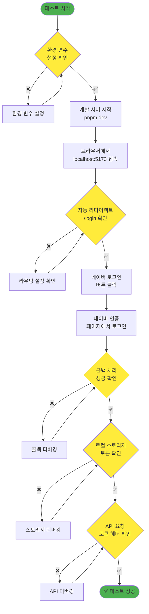
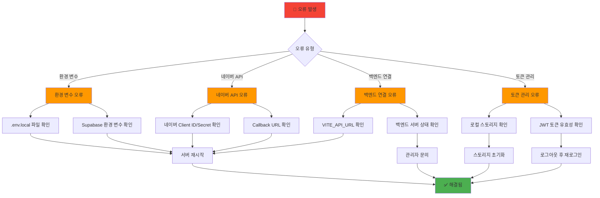

# 🔐 Admin 네이버 로그인 설정 가이드

## 📋 개요

이 가이드는 Admin 애플리케이션에 네이버 소셜 로그인을 설정하는 방법을 설명합니다. Zustand를 사용한 상태 관리와 Supabase Edge Function을 통한 CORS 우회 처리가 포함되어 있습니다.

## 🏗️ 시스템 아키텍처



## 🔄 로그인 플로우



## 🛠️ 설정 단계

### 1️⃣ 네이버 개발자 센터 설정



#### 📝 상세 설정값

| 항목 | 값 |
|------|-----|
| 애플리케이션 이름 | Commerce Admin |
| 사용 API | 네이버 로그인 |
| 환경 | PC웹 |
| 서비스 URL | `http://localhost:5173` |
| Callback URL | `http://localhost:5173/auth/callback` |

### 2️⃣ 환경 변수 설정

#### 로컬 환경 변수 (`apps/admin/.env.local`)

```env
# 네이버 OAuth 설정
VITE_NAVER_CLIENT_ID=your_client_id_here
VITE_NAVER_CLIENT_SECRET=your_client_secret_here

# 백엔드 API 설정
VITE_API_URL=https://api.801base.com

# Supabase 설정
VITE_SUPABASE_URL=https://lmqyvuxfubsudknigrgz.supabase.co
VITE_SUPABASE_ANON_KEY=your_supabase_anon_key
```

#### Supabase Edge Function 환경 변수

Supabase 대시보드에서 설정:

```env
NAVER_CLIENT_ID=your_client_id_here
NAVER_CLIENT_SECRET=your_client_secret_here
```

## 🏗️ 프로젝트 구조



## 📊 데이터 플로우



## 🧪 테스트 가이드

### 테스트 플로우



### 실행 명령어

```bash
# 1. 환경 변수 설정 확인
cat apps/admin/.env.local

# 2. 개발 서버 시작
cd apps/admin
pnpm dev

# 3. 브라우저 접속
open http://localhost:5173
```

## 🐛 문제 해결

### 일반적인 오류와 해결책



### 오류별 해결 방법

| 오류 메시지 | 원인 | 해결 방법 |
|------------|------|-----------|
| `백엔드 URL이 설정되지 않았습니다` | VITE_API_URL 미설정 | `.env.local`에 `VITE_API_URL` 추가 |
| `Server configuration error` | Supabase 환경 변수 미설정 | Supabase 대시보드에서 환경 변수 설정 |
| `Failed to get access token` | 네이버 클라이언트 정보 오류 | 네이버 개발자 센터에서 정보 재확인 |
| `Callback URL mismatch` | 콜백 URL 불일치 | 네이버 개발자 센터에서 콜백 URL 수정 |

## 🔍 디버깅 도구

### 브라우저 개발자 도구 확인 사항

1. **Local Storage** (`admin-auth-storage`):
   ```json
   {
     "state": {
       "user": { "email": "test@naver.com", ... },
       "token": "eyJhbGciOiJIUzI1NiIsInR5cCI6IkpXVCJ9...",
       "isAuthenticated": true
     }
   }
   ```

2. **Network 탭**:
   - API 요청에 `Authorization: Bearer <token>` 헤더 확인
   - Edge Function 호출 성공 여부 확인

3. **Console 로그**:
   - 네이버 인증 과정의 상세 로그 확인
   - 오류 메시지 및 스택 트레이스 확인

## 🎯 주요 특징

- **🔒 보안**: JWT 토큰 기반 인증
- **⚡ 성능**: Zustand를 통한 효율적인 상태 관리
- **🔄 자동화**: 토큰 자동 갱신 및 만료 처리
- **🌐 CORS 해결**: Supabase Edge Function 프록시
- **💾 영속성**: 새로고침 시에도 로그인 상태 유지
- **🛡️ 에러 처리**: 포괄적인 오류 처리 및 사용자 피드백

## 📞 지원

문제가 지속되는 경우:
1. GitHub Issue 생성
2. 개발팀 Slack 채널 문의
3. 이 문서의 디버깅 섹션 참조

---

*📝 이 문서는 Admin 네이버 로그인 구현을 위한 완전한 가이드입니다. 설정 과정에서 문제가 발생하면 위의 문제 해결 섹션을 참조하세요.*